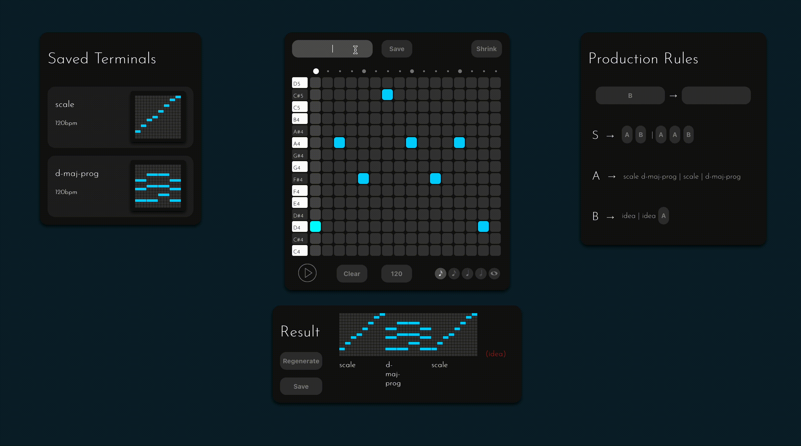
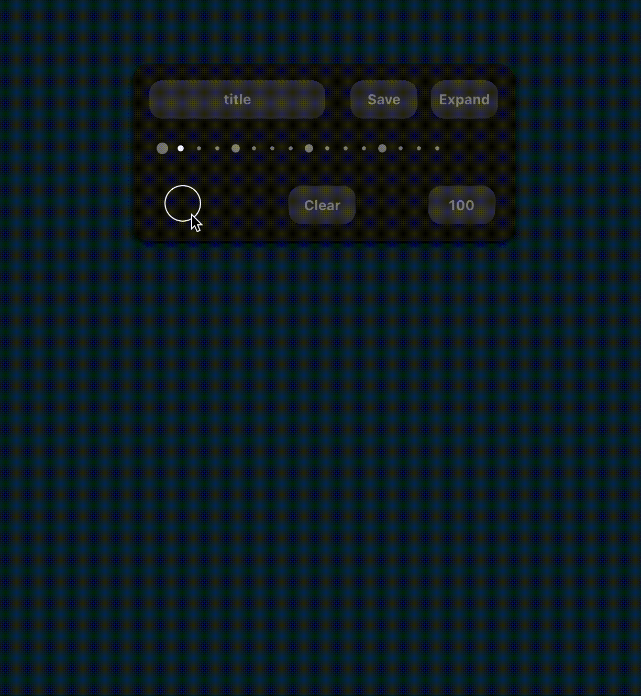
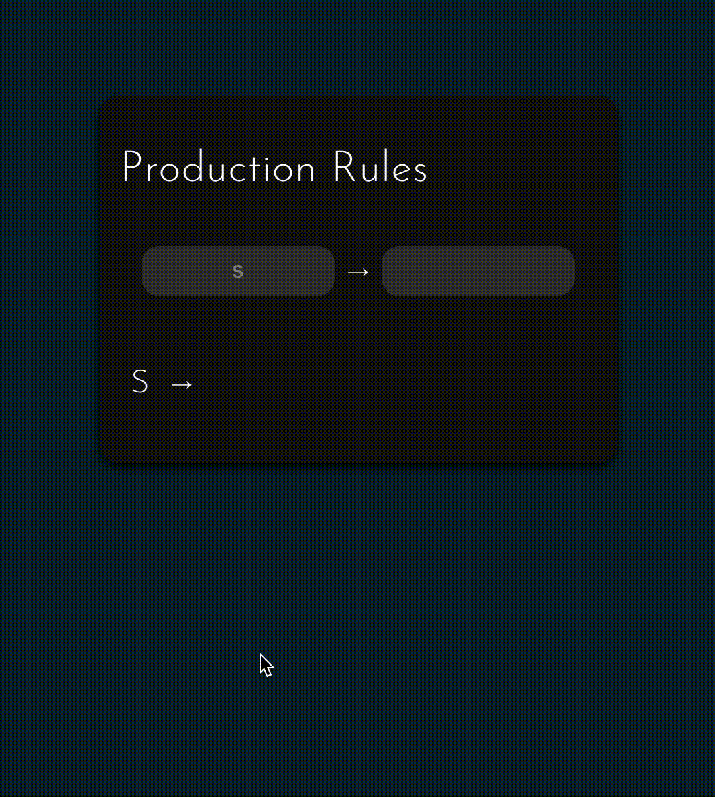
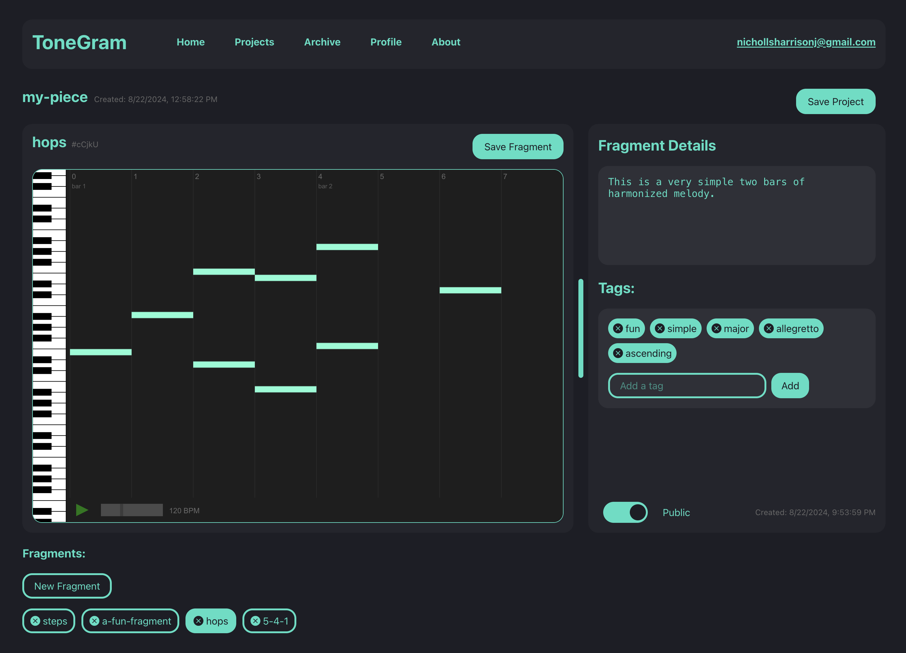

# Harrison Nicholls

## About

I'm a 2023 [Steve Jobs Archive Fellow](https://stevejobsarchive.com/) with a B.A. in Computer Science and minor in Music from Reed College. I specialize in cryptography, theoretical CS, and designing user-centric tools. For much of my life, I've played the violin and composed music, which has led to my current work exploring the intersection of computer science and creative expression through musical composition.

## ToneGram: Grammar-Based Music Composition

I'm building a novel approach to music composition using generative grammars that puts artists at the center of the process. While many new digital composition tools focus on leveraging AI trained on existing musical works, ToneGram proposes a different - but still generative - approach that preserves creative ownership.

<a href="https://www.youtube.com/watch?v=mqZ5z6jlfKc&t=167s" target="_blank">Watch SJA Talk</a>

  <iframe width="560" height="315" src="https://www.youtube.com/embed/mqZ5z6jlfKc?start=40" frameborder="0" allow="accelerometer; autoplay; clipboard-write; encrypted-media; gyroscope; picture-in-picture" allowfullscreen></iframe>

My idea in creating ToneGram is to apply Context-Free Grammars to music composition, where musical phrases have structure that can be described grammatically.

A "grammar" in computer-science terms is a set of replacement rules that transform an initial symbol into a sequence of other symbols according to a specific structure. With ToneGram, these symbols represent musical elements—from individual notes to entire phrases or song structures. As the composer, you design the grammar that generates music with the characteristics you want.

I'm also developing a collaborative dimension where users can contribute fragments to a public archive, with other users building grammars that incorporate these fragments into their own works. This way, in contrast to the problematic use of works without permission as training data for AI music generation, the original fragment authors are credited automatically.

This project is currently in private development with a collaborator.

<a href="assets/tonegram-overview.pdf" target="_blank">Project Overview PDF with description of features and stack</a>

<!-- <a href="https://docs.google.com/presentation/d/1sl_fkNFAMvt3iWnSvBUsd_v2g81E6ExbCbt0efYakUY/edit?usp=sharing" target="_blank">Early Prototype Slides</a>
  -->

### Visual Samples

    

    
    
Generating Music

  

  

    
    
Midi Editor

  

  

    
    
Rule Creation

  

  

    
    
Redesign

  

## Undergraduate Thesis: Formal Verification of Google's QUIC Protocol

My undergraduate thesis at Reed College focused on formal verification of cryptographic key exchange protocols. I used Tamarin Prover, a language for protocol-level formal verification, to analyze the security properties of Google's QUIC protocol.

Internet communication occurs over unsecured networks where many parties can view and manipulate messages sent over public channels. Cryptography aims to protect these communications from malicious actors. While cryptographers can prove properties of individual cryptographic components on paper, guaranteeing security when these components are combined into larger systems becomes increasingly complex.

In my work, I demonstrated how formal verification can be applied to automate security proofs, making it feasible to analyze both small-scale projects and large, complex real-world protocols like QUIC where manual analysis would be impractical.

  <a href="assets/nicholls_harrison_undergraduate_thesis.pdf" target="_blank">Read Full Thesis PDF</a>

## Experience

  <h3>Cryptography Standards Lab (Penumbra) </h3>
  <h4>Information Security Engineer, full time (2024-current)</h4>
  <ul>
    <li>Working on cryptography-related projects as well as tool development</li>
  </ul>

  <h3><a href="https://stevejobsarchive.com/">Steve Jobs Archive</a> Fellowship</h3>
  <h4>Fellow ('23)</h4>
  <ul>
    <li>Developed ToneGram, a novel generative grammar-based music composition tool</li>
    <li>Presented work at the SJA final retreat</li>
  </ul>

  <h3>Reed College</h3>
  <h4>B.A. in Computer Science, Minor in Music ('23)</h4>
  <ul>
    <li>
      Senior thesis on formal verification of Google's QUIC cryptographic protocol
      <a href="assets/nicholls_harrison_undergraduate_thesis.pdf" download class="download-button">My undergraduate thesis (PDF)</a>
    </li>
    <li>Focused on cryptography, theoretical CS, and music composition</li>
    <li><a href="https://www.youtube.com/watch?v=ZYXl-MwN-0s&t=122s" target="_blank">A work for my composition class titled 'Miniatures'</a> featured in a student composition showcase</li>
  </ul>

  <h3>SLAC (Stanford Linear Accelerator Center)</h3>
  <h4>Technology Innovation Directorate Internship (Summers 2020-2023)</h4>
  <ul>
    <li>
      Interned at SLAC throughout college
    </li>
    <li>Contributed lots of Python code to SLAC's internal tools and projects, including a medical device, a telescope sensor array, and a live sensor readout tool</li>
  </ul>

---
