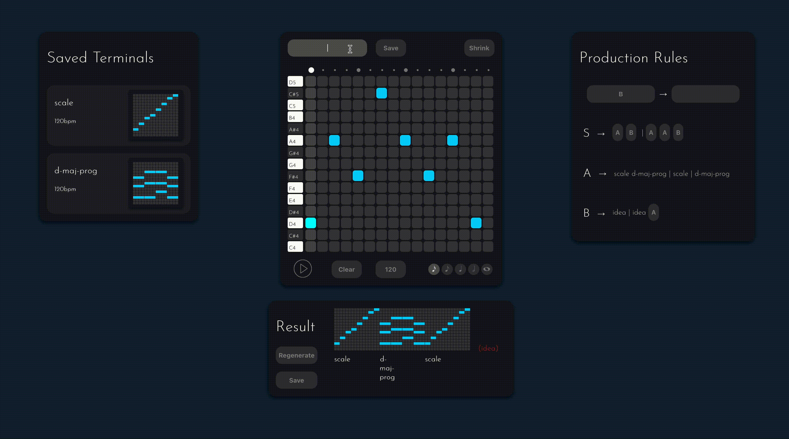
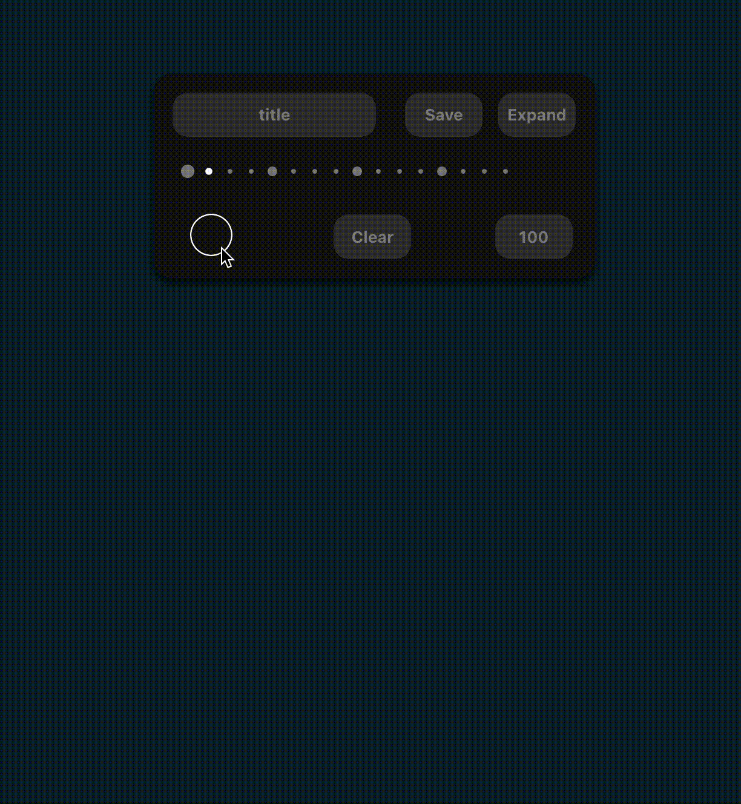
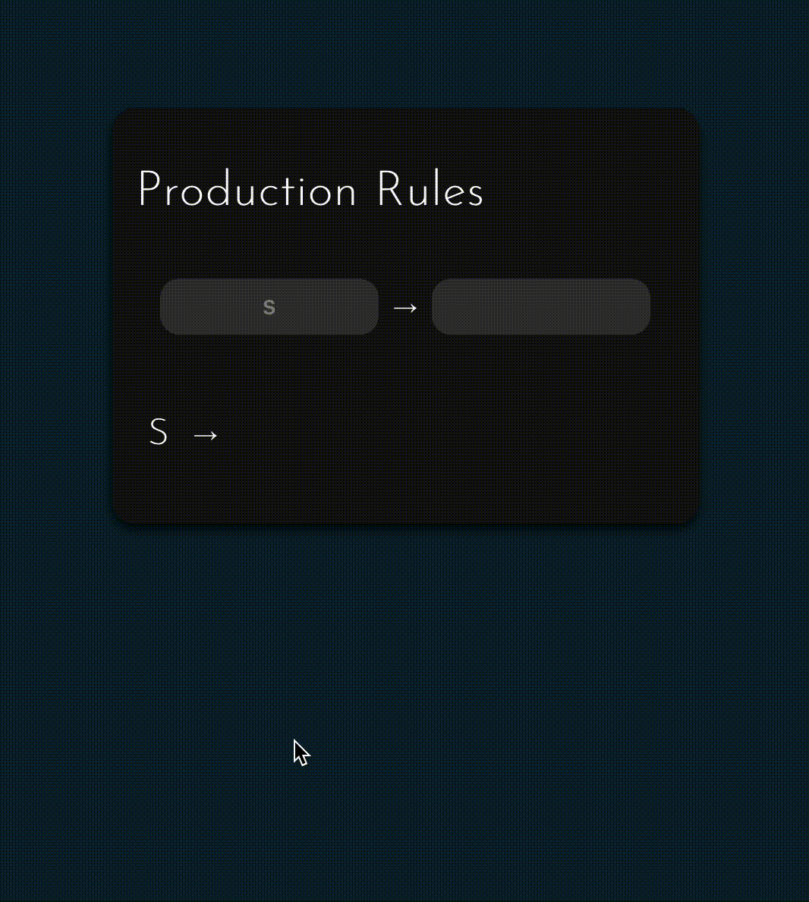
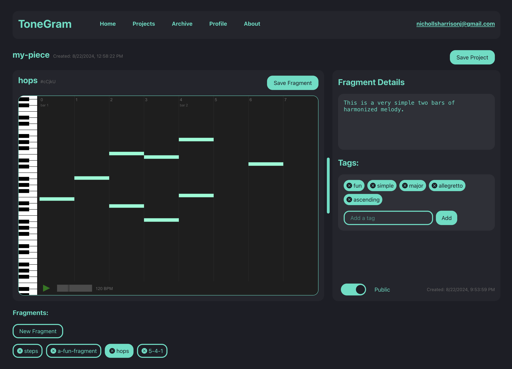

<!-- # Harrison Nicholls -->

## About

I'm a 2023 [Steve Jobs Archive Fellow](https://stevejobsarchive.com/) with a B.A. in Computer Science and minor in Music from Reed College. I build research tools and data systems that make complex information accessible — for scientists, policy researchers, and creative practitioners. My work spans information retrieval, analytical platforms, security research, and generative creative technologies.

## ToneGram: Grammar-Based Music Composition

I'm building a novel approach to music composition using generative grammars that puts artists at the center of the composing process. While many new digital composition tools focus on leveraging AI trained on existing musical works, ToneGram proposes a different — but still generative — approach that preserves creative ownership.

<a href="https://www.youtube.com/watch?v=mqZ5z6jlfKc&t=167s" target="_blank">Watch SJA Talk</a>

  <iframe width="560" height="315" src="https://www.youtube.com/embed/mqZ5z6jlfKc?start=40" frameborder="0" allow="accelerometer; autoplay; clipboard-write; encrypted-media; gyroscope; picture-in-picture" allowfullscreen></iframe>

For much of my life, I've played the violin and composed music, which led to this work exploring the intersection of computer science and creative expression. My idea in creating ToneGram is to apply Context-Free Grammars to music composition through an accessible, user-friendly platform.

A grammar is a set of replacement rules that transform an initial symbol into a sequence of other symbols according to a specific structure. My observation through my music-making experience was that musical phrases have structure that can be described grammatically. With ToneGram, these symbols represent musical elements — from individual notes to entire phrases or song structures. As the composer, you design the grammar that generates music with the characteristics you want.

ToneGram will include a collaborative dimension where users can contribute fragments to a public archive, with other users building grammars that incorporate these fragments into their own works. In contrast to the problematic use of works without permission as training data for AI music generation, original fragment authors are credited automatically.

This project is currently in private development with a collaborator.

<a href="assets/tonegram-overview.pdf" target="_blank">Overview PDF</a>

### Samples

    

    
    
Generating Music

  

  

    
    
Midi Editor

  

  

    
    
Rule Creation

  

  

    
    
Redesign

  

## Undergraduate Thesis: Formal Verification of Google's QUIC Protocol

My undergraduate thesis at Reed College focused on formal verification of cryptographic key exchange protocols. I used Tamarin Prover, a language for protocol-level formal verification, to analyze the security properties of Google's QUIC key-exchange protocol.

Internet communication occurs over unsecured networks where many parties can view and manipulate messages sent over public channels. Cryptography aims to protect these communications from malicious actors. While cryptographers can reasonably prove properties of individual cryptographic components on paper, guaranteeing security when these components are combined into larger systems becomes increasingly complex.

In my work, I demonstrated how formal verification can be applied to automate security proofs, making it feasible to analyze both small-scale projects and large, complex real-world protocols like QUIC where manual analysis would be impractical.

  <a href="assets/tamarin_quic.pdf" target="_blank">Thesis PDF</a>
  <a href="assets/tamarin_quic_slides.pdf" target="_blank">Slides</a>

## Experience

  <h3>Stanford University (Tech, Impact and Policy Center)</h3>
  <h4>Software Engineering Consultant (2026–Present)</h4>
  <ul>
    <li>Sole engineer on a full-stack research platform studying the effects of phone-ban policies in U.S. public schools — a nationally-scoped study involving longitudinal survey data relating to consequential policy changes. Built for non-technical researchers to go from raw data exports to interactive analysis without touching application code.</li>
    <li>Designed a config-driven architecture that lets researchers define versioned survey analysis specifications in human-readable form.</li>
    <li>Collaborated with Stanford infrastructure engineers to ship within a Stanford's Kubernetes environment.</li>
  </ul>

  <h3>Penumbra Security (Cryptography Standards Lab)</h3>
  <h4>Information Security Engineer (2024–Present)</h4>
  <ul>
    <li>Built a fully in-house document retrieval system that lets engineers search and query large volumes of sensitive technical documentation securely and locally. This system was later adopted by the lab's parent organization to launch their AI initiative for cybersecurity compliance workflows in Europe.</li>
    <li>Re-architected the lab's report-writing workflow from manual handoff into a version-controlled, automated pipeline on a self-administered Linux server, significantly reducing manual labor and human error in producing NIST-submittable artifacts.</li>
    <li>Evaluated cryptographic software and entropy sources against NIST standards (ISO/IEC 19790). Entropy work included contributing to the wolfSSL library.</li>
  </ul>

  <h3><a href="https://stevejobsarchive.com/">Steve Jobs Archive</a> Fellowship</h3>
  <h4>Fellow (2023–2024)</h4>
  <ul>
    <li>Selected as 1 of 9 inaugural Fellows nationally for a year-long independent project at the intersection of technology and the arts.</li>
    <li>Designing and developing ToneGram, a grammar-based music composition platform, presented the work at the SJA Annual Retreat to an audience of technology and arts leaders.</li>
  </ul>

  <h3>SLAC National Accelerator Laboratory</h3>
  <h4>Software Engineering Intern, Technology Innovation Directorate (Summers 2020–2022)</h4>
  <ul>
    <li>Built sensor visualization and live readout tools for the Electronics Engineering group, enabling scientists to quickly visualize and debug real-time sensor data during hardware development.</li>
    <li>Contributed to several research projects, including the CMB-S4 telescope sensor array and a medical scanning device.</li>
  </ul>

  <h3>Reed College</h3>
  <h4>B.A. in Computer Science, Minor in Music ('23)</h4>
  <ul>
    <li>
      Senior thesis on formal verification of Google's QUIC cryptographic protocol — <a href="assets/nicholls_harrison_undergraduate_thesis.pdf" download class="download-button">thesis PDF</a>
    </li>
    <li>Focused on cryptography, theoretical CS, and music composition.</li>
    <li><a href="https://www.youtube.com/watch?v=ZYXl-MwN-0s&t=122s" target="_blank">'Miniatures'</a>, a work for my composition class, featured in a student composition showcase.</li>
  </ul>

---
